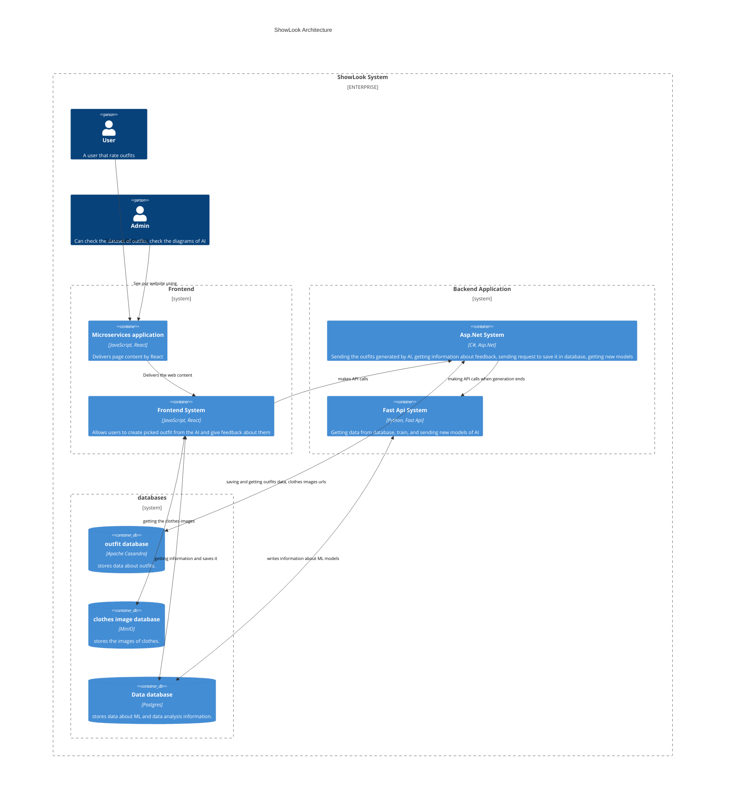
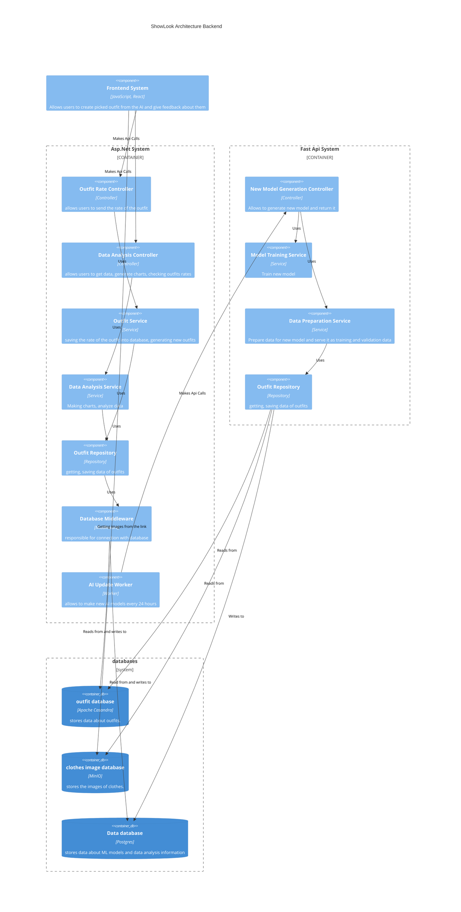

# C4 model

## Level 2

[mermaid documentation link](https://mermaid.ink/img/pako:eNqlVttu2zgQ_RWC24cUUA3Jl_gC7IOstAsvmm5Qo0BbCChoaWwTkUgtScX1Bvn3DinJlmrX2ewCeXComTNnzpyh9EgTmQKd0WgYSWHgu4mF4SYDstzK3Xsp70moki03kJhSQSzeYpAqFNfwbS5LkTK1v1r5HonpIWG51wbymL5-jMUdKC3FVVJqI3NQoQ38pEHF1P4KSYm_idkyQxQzQGRp1txozD1JnbuENOeiyo2YIMkWkntMB5IywzQYItcNhtd-ytlGsVzbx-HCoR_JBxbtnbLdixSfEaRttWBcgLqqmrEhtzxREuk-8AQ0YUWR8YQZLms-f7IHtkwUL4xHPgJLTHV8Axl_wE5IwTZAElfFkNW-iXl9WixsEzqoeaFGmGVyp52WmhhJFFgtC57cQ1rLQdZK5k6LcEEYwm6QFVkDpCuGIrEVhtnHuWP01Nanb0vMMcqyCdttn5WqmpMueh9wHG3y0W8eqc-rgyUCcrFxrOqhkQ0gErJPrUThwsMDY2wQF2upcle4ZtuQ94iugRT8XYI2VgLNsD1smwtnjRWa44glYEdytH2mz-ofOf0ZAoUF77RwtzdbKTzSPMTTmP5Ro9o6lczHikYhsOcEb0gei7fciIK3JR_YYg2KrjbpwPJmdZVWpq1H2wTG1CpfMPQ9iZjGoopVvHGDFHrWMazEq_XudQVw0G7eSSZxLJrw3Nr2WKFaBLH4qwNsJ-giXU917jls19iNpdGFvJPabJRt9Tzd2_dOw-pEsGyvuW5boteoiH8fIWvfN8cFXoL1mSI7WGm80HBfcB4usZ0y__cpTVxrbQ_rbiXBrGbjf8o58HLbkrN7bDe8W5CEZbUpj7EHQlEda110CCa7LYhmbexyoM0qhDnvYNSewcWw-e4KqI3b7J5V1yOdyeOlorJTuNDCOZ80GLbdbub5pEE7qbPTdkVwaTHdnKRGh9SdwjF0Rq-PFmntdCw-FdgPIMbS7DM454hX9nUXyUyq32O6yvAqsfZ7JddrfJN8xrM3I9-B_QJq_hKowVmoEwc9DzTxWydf7ElwAbpttOexxy_CbhvzeezpZSRnz4solk_g-z_j9keX23dG_a-j7jr3_6FEL0OhHkWP5Yyn-HWG9z9B99sXNN6YM_d2UJiHFx7GsdLI5V4kdGZUCR4tXfmb6qOHztYsw3cRLZj4KmXeBOG_dPZIv9PZm8Houjfw-6NJMJ6MA3869Ogej_vDoDfpXw-vg_E0mE77_SeP_uMQgt7In_j-MBiPg2t_PJoOPAopx2v7tvqadB-VTz8A8wKFtA?type=png)
## Level 3

### frontend

work in progress

### backend

[mermaid documentation](https://mermaid.ink/img/pako:eNqtWG1v2kgQ_isrqx9SiUbhPUG6D7w0aZKmrcJFvTshnRZ7gBVmF-0uUBrlv3dmjY1xsHGuly_B9swzzzNvXnj2fBWA1_H6jb6SFn7YkbTChsCGM7X5rNScdbU_ExZ8u9LAetyfgwxGsq8WSyVB2rPh1lhYdCts5F1rwpABi-6NPLp5x9d86GuxtBX2CNy30e1uGKqNYSsD2jCrmAZugS0F4gdMrexEWDbRasHsDFj3lnGEnYo1sAlAMEYajI_RjB5joPcjSZyk5UKC_renVjLgens2rrpYZnn-BWxC6z17HkmGf3sVyScn5GsU_5EoEapWYQg6Ip695hkhhhJApDV5q4n7HAlyPHPi9ghrwC1nXcnDrRHmzZGnKDFAhAp-wixQeH_GtTUV_A_-XMjpjohx5EwRn34qD0PQa-FDFHV_MfIMXxPocbVMSCRFhMbcQEKKHCRsYiZFHAavc5JDBS8euBMYK-bk8RNc_KIYH9P1hqUywiq9jSCz15hgol9hO92ETZpLSLmOpVAu2IMIghA2XMfcM9caDLoZMcZBnCjNfCUlTqBQkm2EnSVJLYp44zr_lj0tLQ-AfVd6HjdO-vOuibBSCz4HVxl0WuBWCA2DNegtqzXYTK10pO_l-JzV3PxzY1l3KfaDlj9nn8jhC0Z7oFDsZtccqPBU23cTxkmbE2tH2a0JDbirJCuet1uXd-fzp0Y1VM_85nIm-zBFwHdJ037TsIxF5UOTFRY-aiYq9qEYHG5ceticHCXHROnBmociiMBP9fj9_9zjL7Rt97Wvk1_ckiZd9V2fDMZnQbSJd5th379UzyXH9cT63KAszSMaBhmBiaJHi35H4DwlNA3vGtAPFe4fw8SCTyEVJZoxefv1AJxWlbM0JHDnm4dfT8p6CPtNGTvVJPs47YfP8TBR0aIH8TITEuu9cDXc5_URwv079fC1hCsOwWnA-ji2US2Om_dKme-ydhOVPM5F8tYNhZwnTmkmhy-JJwPmtVkvZTbIN-unzD7mmw3KmX1MmV3nm12T9GrU_TzYKabybDSedGi1vPa5SUF_Kspu2upw2xwnkza7yze7S5nd55vdH5GWY1UrZeX6_nt-Xq4TI4LKS-VIPi2x9wFdh3YbwvEOf0cH0L4Klf5j5I1DPOTRVL1Tk4kB-xfe-9C8SN35m-7ULlyAk_C9MvDVi7fiuzT-B971i6O4eVN2OkKtWYiXGccSeMX8MnNbJrWFeIM34p2Qm1kEJegV48Ub4zRQO1vpZrHwzF45HeCyGC-zdX5beWY9_XbjZPbYMbwC7_uydbi6OI1TZnJPVC_efqfTUi9BqAyQK79X8RaAJwcR4Fd3d9oaefRFGM8kHXcW0-iG5wm04yurhlvpex2rV1DxVo7AQPCp5guvM-Ehfjfzllz-o9QiNsJLr_Ps_fA6H6qN9nm10WpeVauXrWat3mhUvC3eb9Rb55ftdvWqXWs1W7XmS8X76RCq581arYlPqs128-qq3kIHCOiE-RD91OB-cXj5BSa0mKc?type=png)
