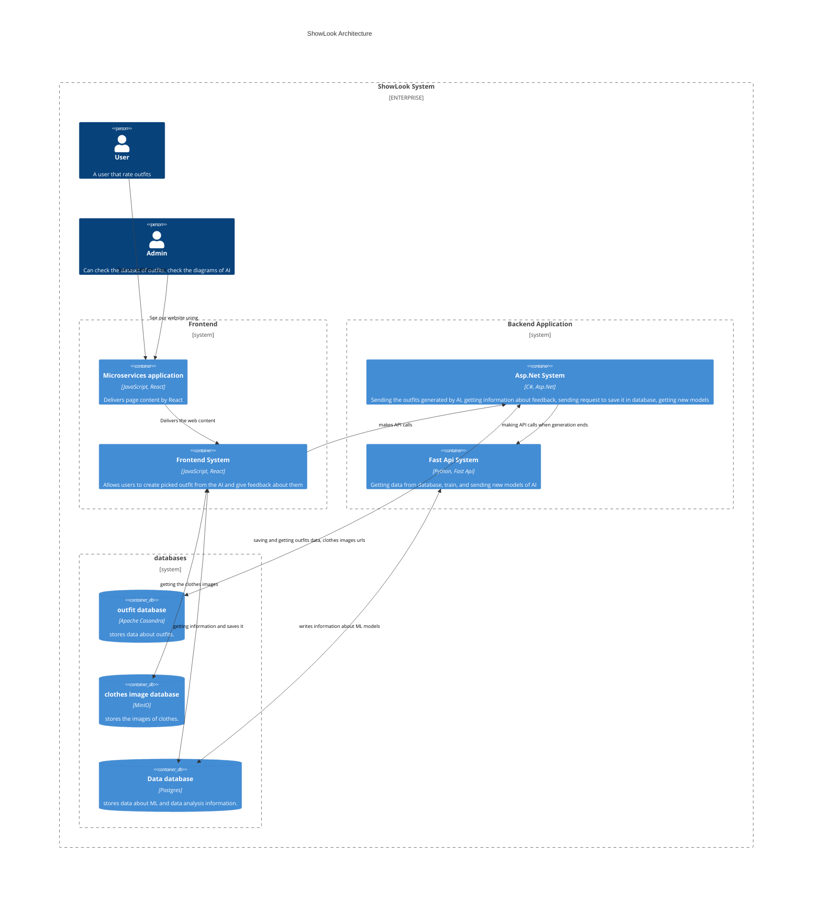
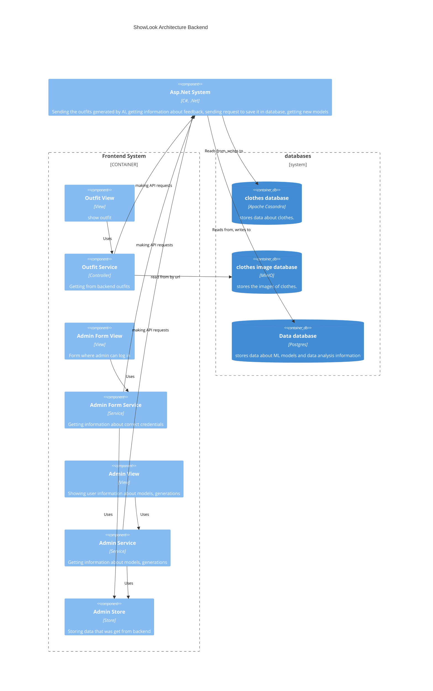

# C4 model

## Level 2

[mermaid documentation link](https://mermaid.ink/img/pako:eNqlVttu2zgQ_RWC24cUUA3Jl_gC7IOstAsvmm5Qo0BbCChoaWwTkUgtScX1Bvn3DinJlmrX2ewCeXComTNnzpyh9EgTmQKd0WgYSWHgu4mF4SYDstzK3Xsp70moki03kJhSQSzeYpAqFNfwbS5LkTK1v1r5HonpIWG51wbymL5-jMUdKC3FVVJqI3NQoQ38pEHF1P4KSYm_idkyQxQzQGRp1txozD1JnbuENOeiyo2YIMkWkntMB5IywzQYItcNhtd-ytlGsVzbx-HCoR_JBxbtnbLdixSfEaRttWBcgLqqmrEhtzxREuk-8AQ0YUWR8YQZLms-f7IHtkwUL4xHPgJLTHV8Axl_wE5IwTZAElfFkNW-iXl9WixsEzqoeaFGmGVyp52WmhhJFFgtC57cQ1rLQdZK5k6LcEEYwm6QFVkDpCuGIrEVhtnHuWP01Nanb0vMMcqyCdttn5WqmpMueh9wHG3y0W8eqc-rgyUCcrFxrOqhkQ0gErJPrUThwsMDY2wQF2upcle4ZtuQ94iugRT8XYI2VgLNsD1smwtnjRWa44glYEdytH2mz-ofOf0ZAoUF77RwtzdbKTzSPMTTmP5Ro9o6lczHikYhsOcEb0gei7fciIK3JR_YYg2KrjbpwPJmdZVWpq1H2wTG1CpfMPQ9iZjGoopVvHGDFHrWMazEq_XudQVw0G7eSSZxLJrw3Nr2WKFaBLH4qwNsJ-giXU917jls19iNpdGFvJPabJRt9Tzd2_dOw-pEsGyvuW5boteoiH8fIWvfN8cFXoL1mSI7WGm80HBfcB4usZ0y__cpTVxrbQ_rbiXBrGbjf8o58HLbkrN7bDe8W5CEZbUpj7EHQlEda110CCa7LYhmbexyoM0qhDnvYNSewcWw-e4KqI3b7J5V1yOdyeOlorJTuNDCOZ80GLbdbub5pEE7qbPTdkVwaTHdnKRGh9SdwjF0Rq-PFmntdCw-FdgPIMbS7DM454hX9nUXyUyq32O6yvAqsfZ7JddrfJN8xrM3I9-B_QJq_hKowVmoEwc9DzTxWydf7ElwAbpttOexxy_CbhvzeezpZSRnz4solk_g-z_j9keX23dG_a-j7jr3_6FEL0OhHkWP5Yyn-HWG9z9B99sXNN6YM_d2UJiHFx7GsdLI5V4kdGZUCR4tXfmb6qOHztYsw3cRLZj4KmXeBOG_dPZIv9PZm8Houjfw-6NJMJ6MA3869Ogej_vDoDfpXw-vg_E0mE77_SeP_uMQgt7In_j-MBiPg2t_PJoOPAopx2v7tvqadB-VTz8A8wKFtA?type=png)
## Level 3

### frontend

[mermaid documentation link](https://mermaid.ink/img/pako:eNqlV11v2jAU_SuW14dWyhAhfEt7YFSrKq3bNNRpmyJNJrmA1cRmtjOaVf3vu04ChJISYDzhm-tz7rkfdvJEAxkCHdJxeyyFgUfjC8NNBGSykKuPUj6QkQoW3EBgEgXkPQseQIS-8MVYxkspQJjLSaoNxCOH-HSkl41PYEhu8qm1jd84xBrz1QS3czEnZgFEJmbGjSZzEKCYgZBMUzK6ddBgjHXiYiZVzAyXgrApupMZQDjFIByiCyAFvxPQhhhJNPsDhBvcRkJm2JRp2GIJWJEYxUbap1e5AGEYR-Zf72UiQqbSy6lrQ_ygbCpEuFFxRZ58QfC31bz59znT8I3Dym7NV8Quc7nbfxoTWijOAjiINwH1hwdQgiwsRUoxQCWjCFS-vik0zpSMyTSv0Tq7h8hGYczFB0zxOv7MQKylUkP2YLUA7ASWeQZMkEjaQh1FU5JVYtqRtrO4ebUPAqkU9iQJFITIwFlUL3RXZJU-2_SWL9GgKkjz9nHW_YoP6kn3JJ-j9ixiI1WZ1i4L0t2_ltKOC44kM2TF7DyanVbKuJ7tzGwnxbPb11Nmo9mMSDFV19PLMJ-nIJI47Xozkz61US1ZgEfAmGkmQsWKGbGR5Y7rOud7GyW5ZfxWGZ_HbA4lFvvsjovbzzvg9uDJPDWRszr8TOW1DWcX9ovUZq6s7uqw7z4WNSOornggWJRqrsvl3Sb2K0TVZ8rrB8N9nvfKvRu30tkcswdb6tGX2_WZWb-9yLACFhYdkZJERfv7XpwkB0e_OvB9z1Nj30d4ZSIOBFAV_nGh_1_YJ4W8YSgG7CuWR2f1cchK4WWNXS6rvL3D3r64X2KvAu6amDSC0zrywr4-jGUk1TufTiM8Oux0XMjZTIP5jra3rWZGc5hkP4_1wN2TgLOmrgd1m4dRj2_5Wq7WkUzn5KbXLFl-WIt3KltlT9Yzt4_gOThvtRTuEQzn5Kz_MmetU4jOTFe1mN1ZPwKlFsY7Cqb1MgVF11CHxoDXFw_xqyG7832KN2iMF-MweyNQiIWXGvqxxMhJKgI6NCoBhyZZSNeczRWL6XCG72xoXTLxU8p47YRLOnyij3T4tt1veN1-p9Md9Lqe2_e6Dk3p0HW7jV6r1-14nabXdnuD3rND_2YIzUa_33Hbbrs1GHj9dqszcCiEHAtwl3_lZB87z_8Afkl73g?type=png)

### backend

```mermaid
C4Context
title ShowLook Architecture Backend
Component(SystemA, "Frontend System", "JavaScript, React", "Allows users to create picked outfit from the AI and give feedback about them")

Container_Boundary(b1, "Asp.Net System") {
    Component(ComponentOutfitController, "Outfit Rate Controller", "Controller", "allows users to send the rate of the outfit")
    Component(ComponentDataController, "Data Analysis Controller", "Controller", "allows users to get data, generate charts, checking outfits rates")
    Component(ComponentAdminFormController, "Admin Form Controller", "Controller", "allows admins to log in")
    Component(ComponentOutfitService, "Outfit Service", "Service","saving the score of the model into database, generating new outfits")
    Component(ComponentDataService, "Data Analysis Service", "Service", "Making charts, analyze data")
    Component(ComponentAdminFormService, "Admin Form Service", "Service", "checking credentials for users")
    Component(ComponentDataRepository, "Data Repository", "Repository", "Saving data about model")
    Component(ComponentAdminRepository, "Admin Repository", Repository, "Getting credentials of admin")
    Component(ComponentMiddleware, "Database Middleware", "Middleware", "Responsible for connection with database")
    Component(ComponentWorker, "AI Update Worker", "Worker", "When actual generation is over call API")
}

Container_Boundary(b2, "Fast Api System"){
    Component(ComponentGenerationController, "New Generation Controller", "Controller", "Create new generation")
    Component(ComponentGenerationService, "New Generation Service", "Service", "Create new generation entity in database")
    Component(ComponentModelsService, "Models Service", "Service","Create new models for generation")
    Component(ComponentDataRepositoryPy, "Data Repository", "Repository", "Saving data about generation and model")
}

Boundary(b3, "databases"){
    ContainerDb(db1, "clothes database" "Apache Casandra", "stores data about clothes.")
    ContainerDb(db2, "clothes image database", "MinIO", "stores the images of clothes.")
    ContainerDb(db3, "Data database", "Postgres", "stores data about ML models and data analysis information")
}

Rel(SystemA, db2, "Read from")
Rel(SystemA, ComponentOutfitController, "Makes Api Calls")
Rel(SystemA, ComponentDataController, "Makes Api Calls")
Rel(ComponentOutfitController, ComponentOutfitService, "Uses")
Rel(ComponentDataController, ComponentDataService, "Uses")
Rel(ComponentOutfitService, ComponentDataRepository, "Uses")
Rel(ComponentDataService, ComponentDataRepository, "Uses")
Rel(ComponentDataRepository, ComponentMiddleware, "Uses")
Rel(ComponentMiddleware, db3, "Writes to, read from")
Rel(ComponentMiddleware, db1, "Writes to, read from")
Rel(ComponentWorker, ComponentGenerationController, "Making Api Calls")
Rel(ComponentGenerationController, ComponentGenerationService, "Uses")
Rel(ComponentGenerationController, ComponentModelsService, "Uses")
Rel(ComponentGenerationService, ComponentDataRepositoryPy, "Uses")
Rel(ComponentModelsService, ComponentDataRepositoryPy, "Uses")
Rel(ComponentDataRepositoryPy, db3, "Writes to, read from")
Rel(ComponentAdminFormController, ComponentAdminFormService, "Uses")
Rel(ComponentAdminFormService, ComponentAdminRepository, "Uses")
Rel(ComponentAdminRepository, ComponentMiddleware, "Uses")

UpdateRelStyle(SystemA, db2, $textColor="black", $offsetX="-50", $offsetY="-20")
UpdateRelStyle(SystemA, ComponentOutfitController, $textColor="black", $offsetX="-50", $offsetY="-20")
UpdateRelStyle(SystemA, ComponentDataController, $textColor="black", $offsetX="-100", $offsetY="-20")
UpdateRelStyle(ComponentOutfitController, ComponentOutfitService, $textColor="black", $offsetX="-50", $offsetY="-20")
UpdateRelStyle(ComponentDataController, ComponentDataService, $textColor="black", $offsetX="140", $offsetY="-100")
UpdateRelStyle(ComponentOutfitService, ComponentDataRepository, $textColor="black")
UpdateRelStyle(ComponentDataService, ComponentDataRepository, $textColor="black", $offsetX="-180")
UpdateRelStyle(ComponentDataRepository, ComponentMiddleware, $textColor="black", $offsetX="-15")
UpdateRelStyle(ComponentMiddleware, db3, $textColor="black", $offsetX="-65")
UpdateRelStyle(ComponentMiddleware, db1, $textColor="black", $offsetX="-25")
UpdateRelStyle(ComponentWorker, ComponentGenerationController, $textColor="black", $offsetX="-95")
UpdateRelStyle(ComponentGenerationController, ComponentGenerationService, $textColor="black", $offsetX="-15")
UpdateRelStyle(ComponentGenerationController, ComponentModelsService, $textColor="black", $offsetY="100", $offsetX="-15")
UpdateRelStyle(ComponentGenerationService, ComponentDataRepositoryPy, $textColor="black", $offsetY="-80", $offsetX="-15")
UpdateRelStyle(ComponentModelsService, ComponentDataRepositoryPy, $textColor="black",  $offsetX="-15")
UpdateRelStyle(ComponentDataRepositoryPy, db3, $textColor="black")
UpdateRelStyle(ComponentAdminFormController, ComponentAdminFormService, $textColor="black", $offsetX="-50", $offsetY="-10")
UpdateRelStyle(ComponentAdminFormService, ComponentAdminRepository, $textColor="black")
UpdateRelStyle(ComponentAdminRepository, ComponentMiddleware, $textColor="black")

```

[mermaid documentation](https://mermaid.ink/img/pako:eNq1WFlv2zgQ_iuE0IcEcAJbtuMD2AfXQYssmjaIUXR3YWBBS7RNRCINkk7qBvnvHZKyLut0dvMSaTQz39xD-tXxuE-cqTMfzDlT5KdaMkVVQNBiy1--cP6EZsLbUkU8tRcEfcTeE2H-ks15uOOMMHWxOEhFwlkHLZ1PQutgPrK0paOJf-JnvPAE3akOeiTYU5Y8CwL-ItFeEiGR4sgTBCuCdhQAfMT3ak0VWgseIrUlaHaHMOjd0GeC1oT4K7AD4RWw6c-AdLlk2iimMGVE_PuR75mPxeFi1TNgcnf9lajYrkv0umQI_hI34qdvBlqrEjwIiNDyloYetYXJF-tI_h3nHJM6INoHoaX52jxb_4zZJWbcYoWzRmgKmjEcHCSVrc3YgPs-aOjAE0RI2-JtsVCyA_-J90TZJrJKGktllXEzP6TsExdh1kJDRpre1DysJYx9Ad8gyqpAbRIWRDxTj6SyElGs3uRl6Uj8rL3S8ZYeF3HwQyj5AMAAVUdkhSWJo6IFGHk5hqIuQylrsukpMQpe7rGJ9TH4WEv8IsaSRiFPQabiXY4XZxc6zAdFFAcSrbmwpVHn4CPZcUkVF4fYx4RkAfLvCxt27VDUoibgtc5loaxvWd1Zjs9EqbxfkGFTUlVg99T3A_KCRZw2XQEoIUd5yr0_Egnykq5gOOrweZwxmIqUM_RC1TYupSroH1w8Ra1yh77vfN2FlmYxMs9bwhCMyz0O4uIELKgt_kwAHjoIzR7uDNxb2fRzzVjGUqHZjibjr3z6fY6Rsq39FXoi-Vbb3nM7zXUnJbZXRSbRnarvHGh5jRfCIV0U6gCN3ig397pIZQrdEsrHSwo0tKy6LJq5m22th_c0V8phvSKTXjNFkZRCX4sfAyHTRRCVze3qwrfr0gs4zEmZCpuu2B2GUYLmWAKMwNYcCZZFjJE5kex1yvu0fjetn4Z4Q1Iotu3Y3beMcj2yDadp7xr9_TiSWbUPXKqN0H4Xm33_5ZhEHUT74TjLKYPEhklOTWAfSZAcfSK_4HjjmzOLYctwVB4vYCWANbpD59DVskL69FRQJlsBWL5Rv0tSoCEPWrYBi6VzIBXbpRz9fdJpvpItUCyc5olK64eAs7A-sHSQOMl2iWCvueBxQdTO4-gUUZH3YsnqgVschhpNJ4OzTktdNh8q8pkDO0PDKWer1BYefStPacVmnHJWnYYqdLSp7iWzhw7QslCHgOQm2Ad9AZzzgIs_ls4qgDuWHpcf-HotifoLaFfDboryt6a4XaO5TG_FGPo_0fIjqx6r120IdsZg_e88bTmTa4F7gxNgE4hat-snchF2jUPnKc3lcVwfuNqWaQAzrEQ52Rz1Gm_aaOw10ehWa2y4a-pxJtU47RfRu8PfbmNVwumeyM6GdgY0WVW1BlyN2xrQfE8Wg7fBKtmoLQdA28V6zlDtdZuZ0GAnn-PdWXPn0uk4IYH7B_WdqWMubUtH_-gJN5upudIJ4IJbCfDhveKLA_OcqRJ70nH2xppbijcCh850jQMJ1B1m_3AeHpng1Zm-Oj-d6dXkejwZjgaDvtsf9buDm0nHOQDZ7Y6vJ1135A7d3mTk3gxv3jrOL6Oid92fTPruYDQGhslwPOw4xNcu3tvflc3Py2-_AQBr6Bc?type=png)
