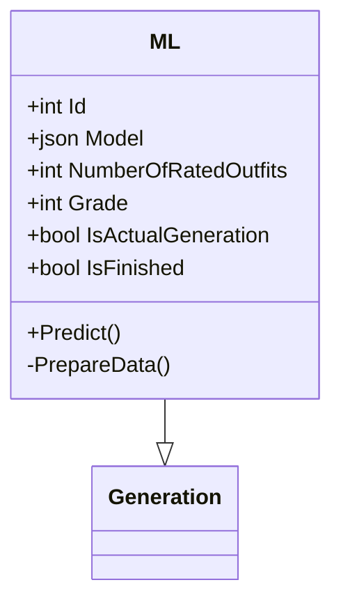
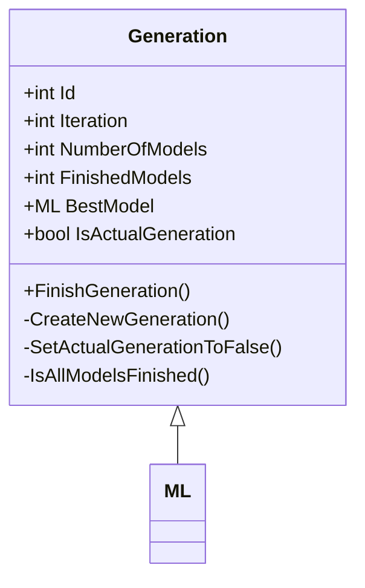

# Data Architecture

## Postgres Data Architecture

### Settings Table (Future)

### ML table

### Generation table

### Outfits Data Analysis Table

## Apache Casandra Architecture

## S3 Minio Architecture