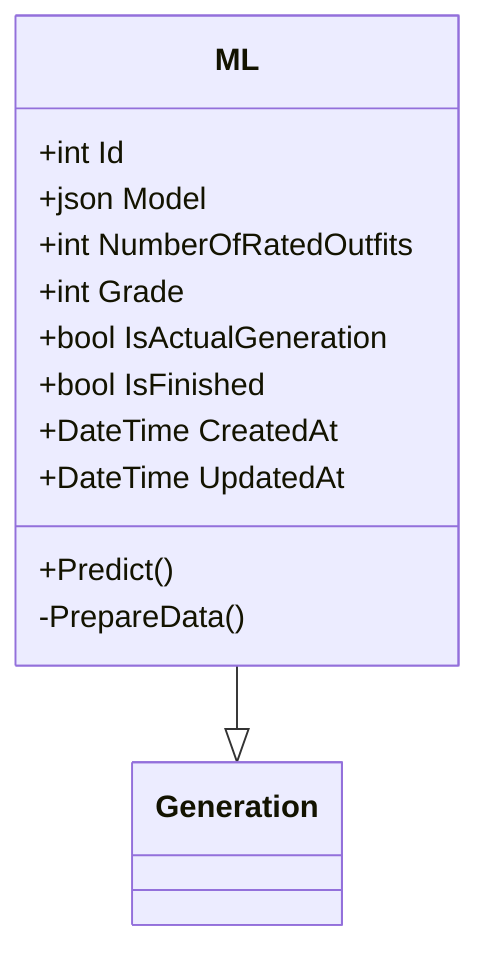
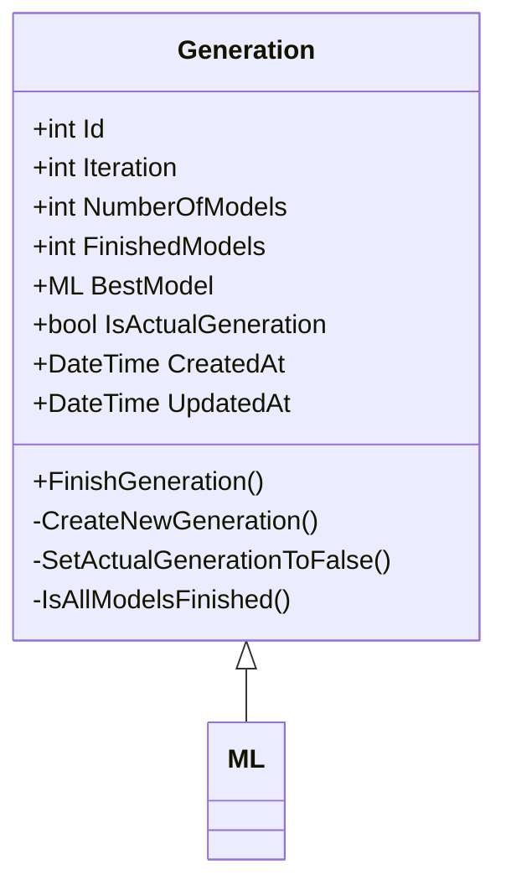
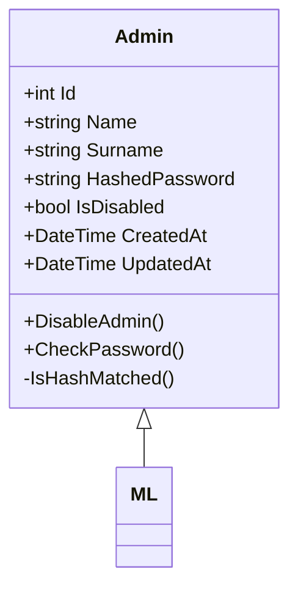
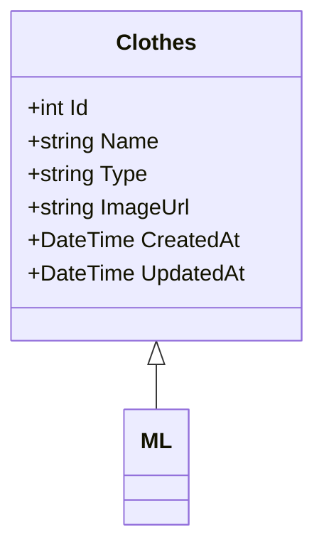
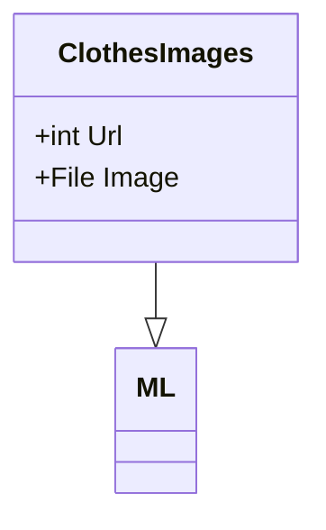

# Data Architecture

## Postgres Data Architecture

### Settings Table (Future)

### ML table

```mermaid
classDiagram
    ML --|> Generation
    ML: +int Id
    ML: +json Model
    ML: +int NumberOfRatedOutfits
    ML: +int Grade
    ML: +bool IsActualGeneration
    ML: +bool IsFinished
    ML: +DateTime CreatedAt
    ML: +DateTime UpdatedAt
    ML: +Predict()
    ML: -PrepareData()
    
```

### Generation table

```mermaid
classDiagram 
    Generation <|-- ML
    Generation: +int Id
    Generation: +int Iteration
    Generation: +int NumberOfModels
    Generation: +int FinishedModels
    Generation: +ML BestModel
    Generation: +bool IsActualGeneration
    Generation: +DateTime CreatedAt
    Generation: +DateTime UpdatedAt
    Generation: +FinishGeneration()
    Generation: -CreateNewGeneration()
    Generation: -SetActualGenerationToFalse()
    Generation: -IsAllModelsFinished()
    
```

### Admin table

```mermaid
classDiagram 
    Admin <|-- ML
    Admin: +int Id
    Admin: +string Name
    Admin: +string Surname
    Admin: +string HashedPassword
    Admin: +bool IsDisabled
    Admin: +DateTime CreatedAt
    Admin: +DateTime UpdatedAt
    Admin: +DisableAdmin()
    Admin: +CheckPassword()
    Admin: -IsHashMatched()
```

### Clothes table

```mermaid
classDiagram 
    Clothes <|-- ML
    Clothes: +int Id
    Clothes: +string Name
    Clothes: +string Type
    Clothes: +string ImageUrl
    Clothes: +DateTime CreatedAt
    Clothes: +DateTime UpdatedAt
```

## S3 Minio Architecture

```mermaid
classDiagram 
    ClothesImages--|>ML
    ClothesImages: +int Url
    ClothesImages: +File Image
```