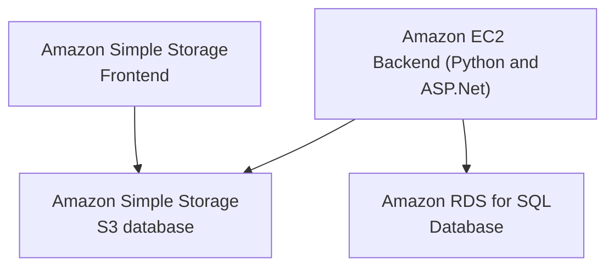

# Infrastructure architecture

[mermaid documentation](https://mermaid.ink/img/pako:eNp9UU1PwzAM_SuWTyBtHNitB6RB2QnQIJwgHEzjrdWapMpSoTLtv-O1tKUIkZPj95Hn-ICZN4wJbkr_keUUIjyn2oGcVfAusjOvGpeWPr0DVdiqZFDRB9oyaOH1JND41smuKdtNVLc3ly31G4CzdRNz6ZPUS7W-eOB4PqjV411Kkd5pz6PDU6pg48MJbJ16xqharIqSVbOPbP-NqxZgfouHEebzq4kTTAbq4DHeH-APLc7QcrBUGPnbw4mrMeZs5dlESkNhp1G7o_Cojl41LsMkhppnWFcSkdOCtoFs36zIvXg_XNkUMtV9t7p2g8cvmh6WfQ?type=png)
